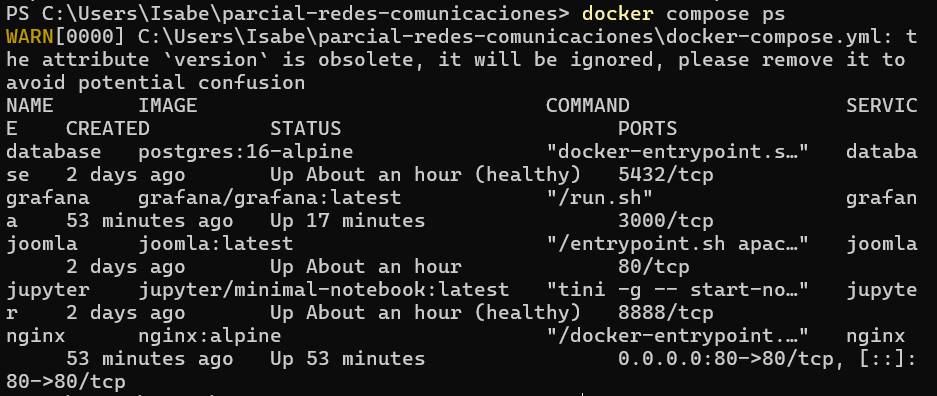
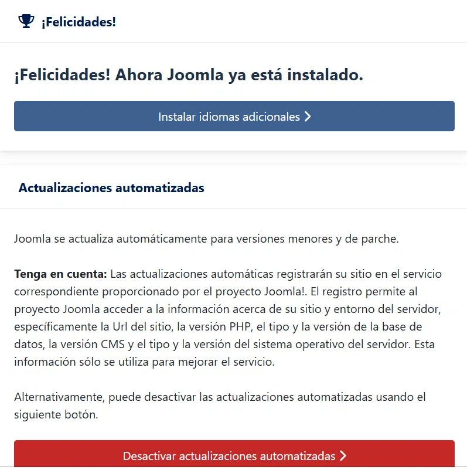
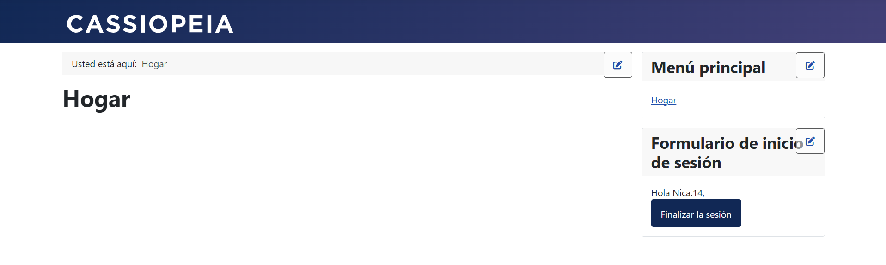
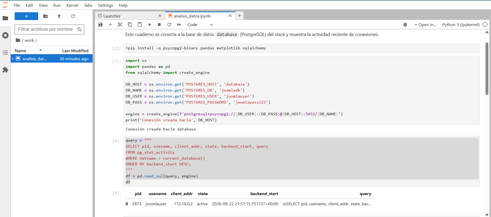
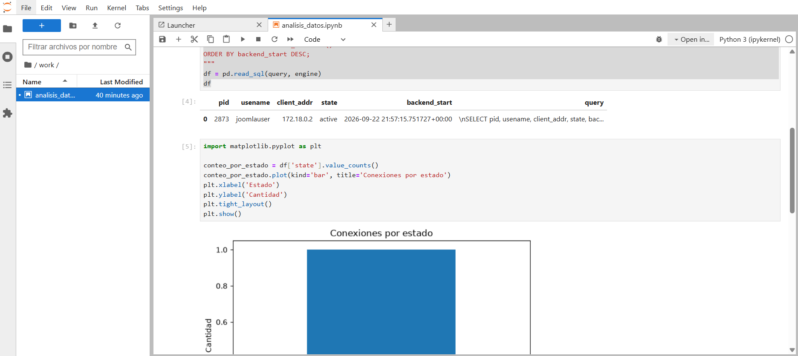
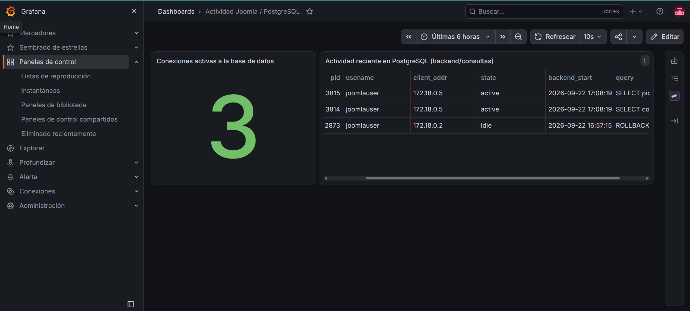

# INFORME.md — Parcial 2: Despliegue multi-contenedor

## Sección 1: Topología y Flujo de Información

*(Inserta aquí el diagrama de arquitectura — puedes reutilizar el del enunciado o
regenerarlo con tus propios nombres de servicio/redes/puertos.)*

Flujo resumido:
1. El navegador del usuario solo conoce **un punto de entrada**: `nginx:80`.
2. `nginx` enruta por prefijo de ruta (`/`, `/jupyter/`, `/grafana/`) hacia los
   contenedores internos `joomla`, `jupyter` y `grafana`, todos en `frontend_net`.
3. `joomla` persiste sus datos en `database` (PostgreSQL), visible solo en `backend_net`.
4. `grafana` consulta directamente a `database` (datasource PostgreSQL) para construir
   los paneles — así no depende de leer archivos de log manualmente.
5. `jupyter` también se conecta a `database` para ejecutar consultas analíticas en Python.

**Mecanismo de recolección de métricas:** en este stack, en vez de un pipeline de logs
(Nginx → Loki/Promtail → Grafana), se optó por un datasource de Grafana apuntando
directamente a PostgreSQL (`pg_stat_activity`), lo que cumple el requisito de "sin
configuración manual" porque el datasource y el dashboard quedan declarados en
`grafana/provisioning/`.
## Sección 2: Análisis Detallado del Modelo OSI en la Solución

### Capa 7 (Aplicación)
- **Cabeceras HTTP de Nginx:** `Host`, `X-Real-IP`, `X-Forwarded-For` y
  `X-Forwarded-Proto` permiten que Joomla y Grafana, detrás del proxy, conozcan la IP
  real del cliente y el protocolo original (aunque internamente todo viaje por HTTP plano).
- **HTTP Upgrade (WebSockets):** el kernel de Jupyter usa WebSockets para mantener una
  conexión bidireccional persistente. Nginx debe reenviar las cabeceras `Upgrade` y
  `Connection: upgrade` (ver `nginx/default.conf`) para que la conexión HTTP inicial se
  "actualice" a WebSocket sin cerrarse.
- **Protocolo de PostgreSQL:** cliente y servidor usan el protocolo binario propio de
  PostgreSQL (frontend/backend protocol) sobre TCP/5432, no HTTP.
- **Logs de Joomla:** Apache (dentro del contenedor `joomla`) genera logs en formato
  Common/Combined Log Format en `/var/log/apache2/`.

### Capa 4 (Transporte)
- Puertos TCP: **80** (Nginx, único publicado al host), **5432** (PostgreSQL, solo interno),
  **8888** (Jupyter, proxied por Nginx), **3000** (Grafana, proxied por Nginx).
- Nginx mantiene conexiones persistentes (`keep-alive`) tanto con el cliente como con los
  backends, reduciendo el overhead de abrir/cerrar conexiones TCP en cada petición.
- Joomla/Grafana usan *connection pooling* implícito del driver PDO/pgx hacia PostgreSQL
  para reutilizar conexiones TCP en vez de abrir una nueva por consulta.
  ### Capa 3 (Red)
- `frontend_net` y `backend_net` son dos redes bridge separadas; solo `joomla` (y
  opcionalmente `grafana`) tiene una interfaz en ambas, actuando de frontera entre ellas.
  `database` **no** tiene ninguna interfaz en `frontend_net`, por lo que es inalcanzable
  desde `nginx` o desde fuera del host.
- Docker asigna un DNS embebido en `127.0.0.11` dentro de cada contenedor, que resuelve
  nombres de servicio (`database`, `joomla`, `grafana`, `jupyter`) a la IP interna
  correspondiente en cada red — por eso `docker-compose.yml` usa nombres, no IPs fijas.
- El kernel del host aplica reglas **NAT (MASQUERADE)** vía `iptables` para que el tráfico
  saliente de los contenedores parezca originarse en la IP del host, y hace **DNAT** para
  redirigir el puerto 80 del host hacia el contenedor `nginx`.

### Capa 2 (Enlace de Datos)
- Cada red bridge de Docker crea un puente Linux (`br-xxxxx`) en el host; cada contenedor
  conectado a esa red recibe una interfaz virtual `veth*` que se une a ese puente, análogo
  a conectar un cable de red a un switch.
- Dentro de una misma red bridge, la resolución de direcciones MAC ocurre por **ARP**
  estándar entre las interfaces `veth*` de los contenedores conectados al mismo puente.
  ## Sección 3: Guía de Verificación y Demostración

1. **Joomla:** abrir `http://localhost/`, completar (la primera vez) el instalador con
   `JOOMLA_DB_TYPE=pgsql`, host `database`; luego navegar el sitio para generar tráfico.
2. **Grafana:** abrir `http://localhost/grafana/`, iniciar sesión con las credenciales de
   `.env`; el dashboard "Actividad Joomla / PostgreSQL" debe estar precargado sin pasos
   manuales y reflejar las conexiones generadas al navegar Joomla.
3. **Jupyter:** abrir `http://localhost/jupyter/` con el token de `.env`, abrir
   `analisis_datos.ipynb` y ejecutar todas las celdas: debe conectarse a PostgreSQL y
   graficar la actividad reciente.

